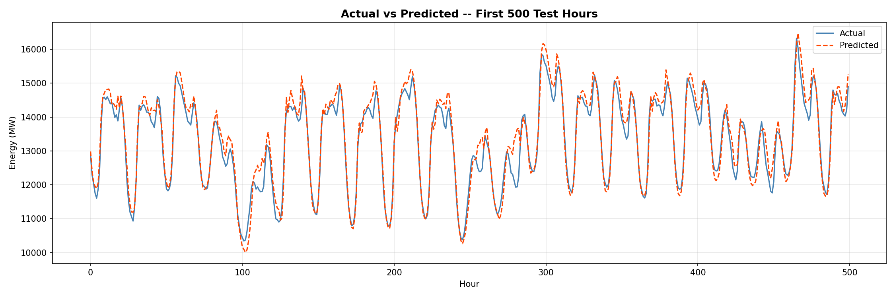
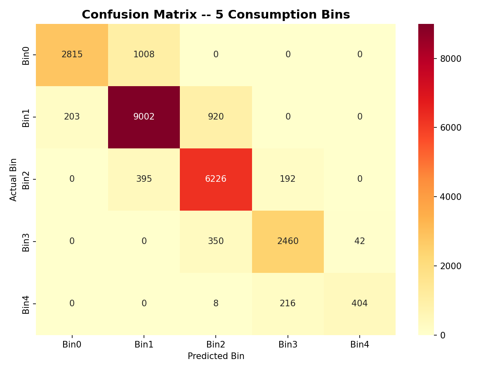
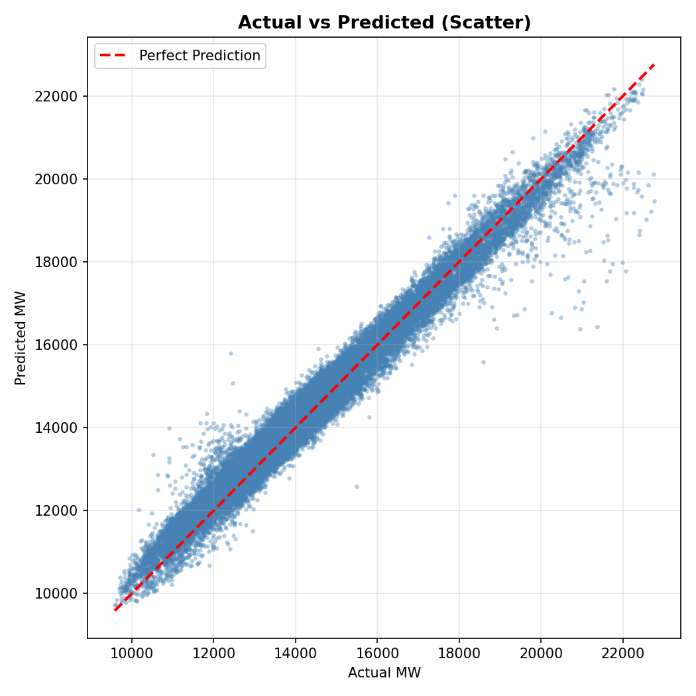
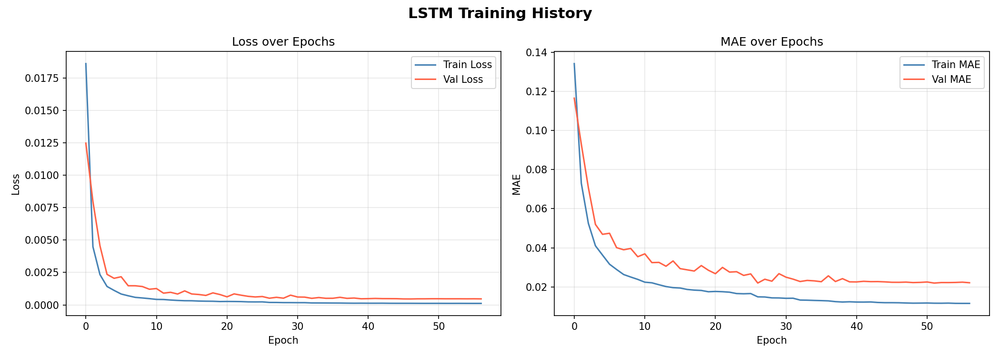

# Smart Grid Energy Forecasting using LSTM

A deep learning-based smart grid forecasting system that predicts hourly energy consumption using LSTM neural networks, time-series feature engineering, and multi-step forecasting techniques.

---

## Overview

Accurate energy demand forecasting is critical for modern smart grid systems to ensure:
- efficient power distribution
- load balancing
- energy optimization
- operational stability

This project uses Long Short-Term Memory (LSTM) neural networks to predict future hourly electricity consumption from historical time-series energy data.

The system includes:
- preprocessing pipeline
- sequence generation
- LSTM training
- model evaluation
- forecasting engine
- visualization system

---

## Key Features

- Hourly energy demand prediction
- LSTM-based deep learning model
- Multi-step future forecasting
- Interactive forecasting system
- Time-series feature engineering
- Regression and classification evaluation
- Automated visualization generation
- CSV forecast export support

---

## Technologies Used

- Python
- TensorFlow / Keras
- LSTM Neural Networks
- Scikit-learn
- Pandas
- NumPy
- Matplotlib
- Seaborn

---

## Dataset

### AEP Hourly Energy Consumption Dataset
- Real-world electricity consumption data
- Hourly smart grid demand records

Dataset Source:
https://www.kaggle.com/datasets/robikscube/hourly-energy-consumption

---

## Model Architecture

```text
Historical Energy Data
            ↓
Feature Engineering
            ↓
Sequence Generation
            ↓
LSTM Neural Network
            ↓
Energy Forecast Prediction
            ↓
Evaluation & Visualization
```

---

## Features Engineered

- Hour of day
- Day of week
- Month
- Weekend indicator
- Cyclical time encoding
- Lag features
- Rolling mean statistics
- Rolling standard deviation

---

## Model Performance

### Regression Metrics
- MAE (Mean Absolute Error)
- RMSE (Root Mean Squared Error)
- MAPE (Mean Absolute Percentage Error)
- R² Score

### Classification Metrics
- F1 Score
- Confusion Matrix
- Consumption Bin Analysis

---

## Visualizations

### Actual vs Predicted Energy Consumption


### Confusion Matrix


### Scatter Plot


### LSTM Training History


---

## Project Structure

```text
Smart-Grid-Energy-Forecasting-using-LSTM/
│
├── train.py
├── forecast.py
├── evaluate.py
├── model.py
├── data_preprocessing.py
├── requirements.txt
├── best_lstm.keras
├── scaler.pkl
├── actual_vs_predicted.png
├── confusion_matrix.png
├── scatter_plot.png
├── training_history.png
├── forecast_25-03-2026.csv
├── README.md
└── .gitignore
```

---

## Installation

1. Clone the repository

```bash
git clone https://github.com/khushisoni/Smart-Grid-Energy-Forecasting-using-LSTM.git
```

2. Install dependencies

```bash
pip install -r requirements.txt
```

---

## Run the Project

### Train the model

```bash
python train.py
```

### Forecast future energy demand

```bash
python forecast.py
```

### Evaluate model performance

```bash
python evaluate.py
```

---

## Forecasting Capabilities

- Single date-time prediction
- Multi-hour forecasting
- Full-day forecasting
- Demand-level classification
- CSV export support

---

## Applications

- Smart grid systems
- Energy demand forecasting
- Utility load balancing
- Power consumption analytics
- Renewable energy planning
- Intelligent energy management systems

---

## Future Improvements

- Transformer-based forecasting models
- Real-time smart grid deployment
- Web dashboard integration
- IoT smart meter integration
- Renewable energy forecasting
- Cloud deployment

---

## Project Status

Completed

---

## Author

Khushi Soni
